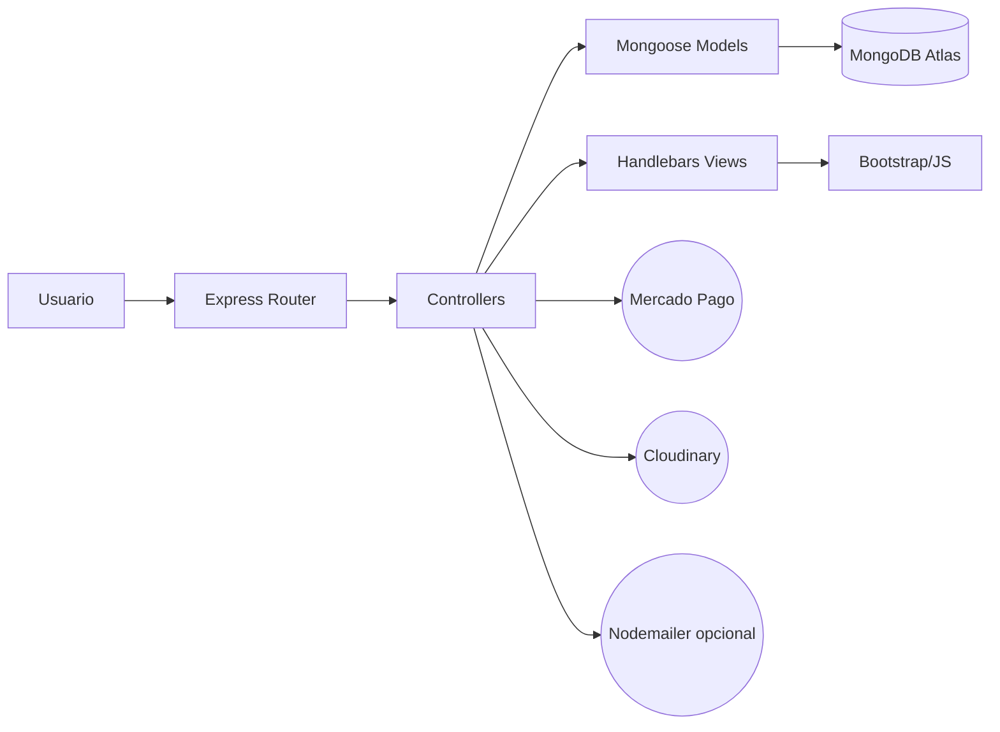
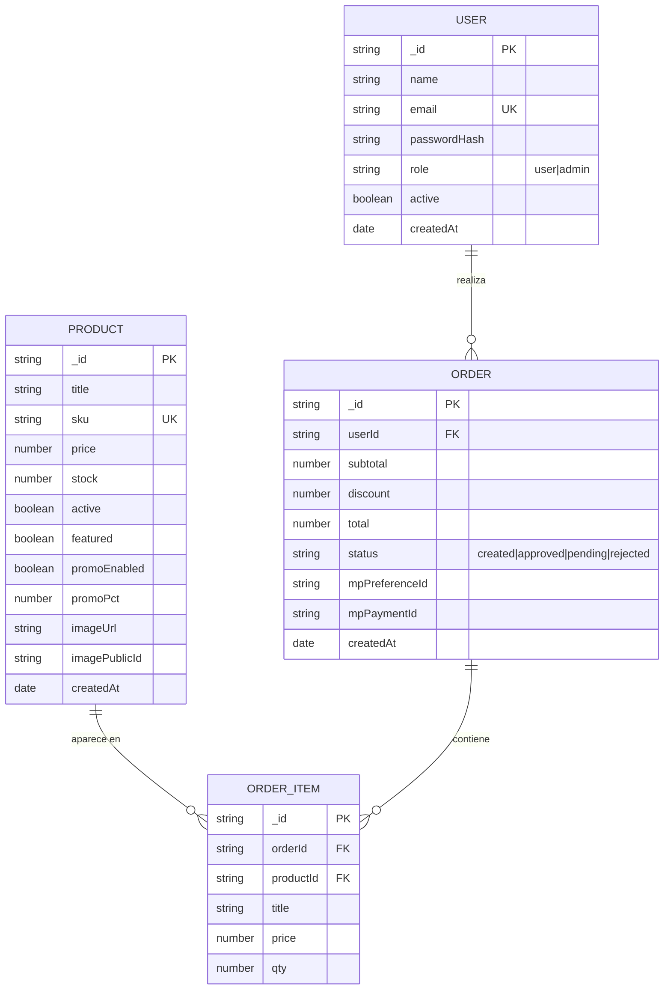
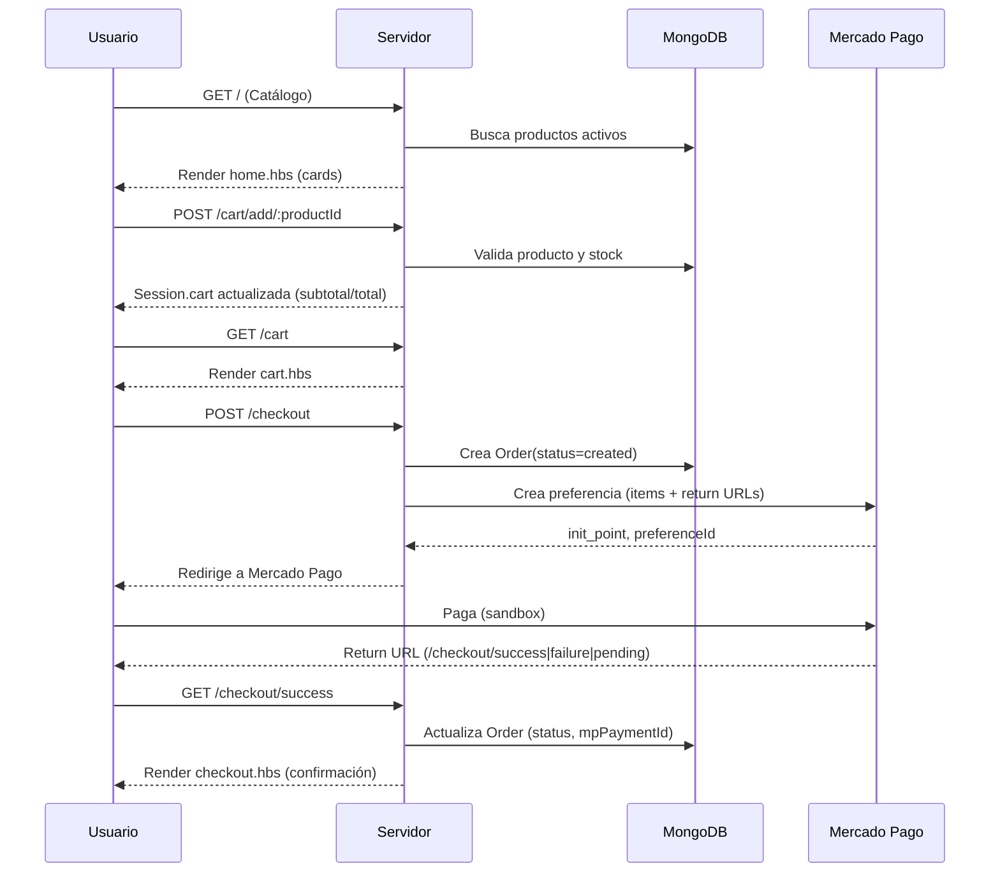
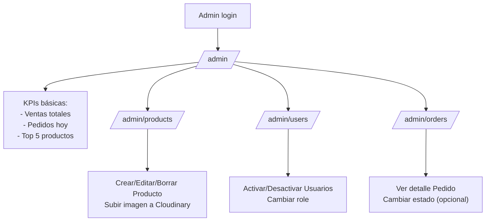
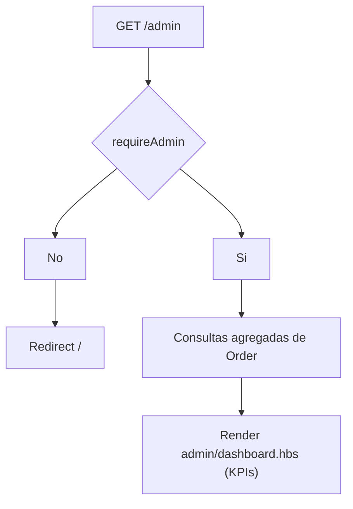
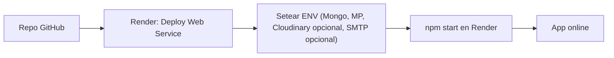

# 🛒 E-Commerce Express + Handlebars + MongoDB

**Proyecto académico (6 integrantes / 6 módulos)**

> **Propósito de este documento:** ofrecer una visión general, gráfica y navegable del proyecto (alto nivel), dejando secciones preparadas para profundizar luego **módulo por módulo**.  
> **Formato:** Markdown + diagramas Mermaid. Nada de código ahora: solo arquitectura, flujos, responsabilidades y mapas.

---

## 1) Visión General

- **Qué es:** un e-commerce académico, simple de entender y desplegar.
- **Stack:** Node.js (Express), Handlebars, Bootstrap 5, MongoDB Atlas (Mongoose), Mercado Pago (sandbox), Cloudinary (imágenes), Sessions (connect-mongo), Nodemailer (opcional), bcrypt, dotenv, morgan, helmet.
- **Requerimientos académicos mínimos:**
  - **CRUD:** Usuarios y Productos.
  - **Auth:** Login / Logout, roles `user` y `admin`.
  - **Admin:** panel con vista global (usuarios, productos, pedidos).
  - **Compra:** Carrito + Checkout con **Mercado Pago (sandbox)**.
  - **Medios:** Imágenes a **Cloudinary** (o local si no configurado).
  - **Notificaciones:** Emails con **Nodemailer** (opcional, p.ej. confirmación de compra).

---

## 2) Estructura de carpetas (mapa + explicación por archivo)

> Se reorganizó la carpeta `views/` por **módulos**, para que cada integrante trabaje de forma aislada y evitar conflictos.  
> Los archivos compartidos (layouts, partials, helpers) siguen centralizados.  
> Esta estructura es la base estable para los 6 módulos académicos.

```
ecommerce/
├─ package.json
├─ .env
├─ README.md
├─ public/                        # Archivos estáticos servidos por Express
│  ├─ css/
│  │  ├─ bootstrap.min.css        # Framework CSS principal (Bootstrap 5, CDN local)
│  │  └─ styles.css               # Hoja personalizada para ajustes menores o overrides
│  │
│  ├─ js/
│  │  ├─ bootstrap.bundle.min.js  # Scripts oficiales de Bootstrap (con Popper incluido)
│  │  └─ app.js                   # Script base del proyecto (eventos globales, alertas, etc.)
│  │
│  └─ img/
│     └─ logo.png                 # Logotipo de la app usado en el navbar/footer
├─ src/
│  ├─ server/
│  │  └─ server.js               # Punto de entrada Express: Handlebars, sesiones, rutas base
│  │
│  ├─ config/
│  │  ├─ env.js                  # Carga .env + validaciones mínimas
│  │  ├─ db.js                   # Conexión a MongoDB (Mongoose)
│  │  └─ cloudinary.js           # Inicialización SDK Cloudinary
│  │
│  ├─ middlewares/
│  │  ├─ auth.js                 # requireAuth, requireAdmin, setUserInViews
│  │  └─ errors.js               # Manejo global de errores y asyncHandler
│  │
│  ├─ models/
│  │  ├─ User.js                 # Esquema Usuario (email único, role, hash)
│  │  ├─ Product.js              # Esquema Producto (precio, stock, imagen)
│  │  └─ Order.js                # Esquema Pedido (items, totales, estados MP)
│  │
│  ├─ services/
│  │  ├─ mp.service.js           # Integración Mercado Pago (preferencias)
│  │  ├─ image.service.js        # Subida/borrado en Cloudinary (opcional)
│  │  └─ cart.service.js         # Lógica de carrito (totales, promos, qty)
│  │
│  ├─ controllers/
│  │  ├─ auth.controller.js      # Registro, login, logout
│  │  ├─ product.controller.js   # Catálogo y CRUD admin de productos (unificado)
│  │  ├─ order.controller.js     # Checkout, creación/actualización de pedidos
│  │  ├─ cart.controller.js      # Operaciones sobre carrito en sesión
│  │  └─ admin.controller.js     # Dashboard (KPIs) y vistas admin
│  │
│  ├─ routes/
│  │  ├─ index.js                # Home: catálogo + filtros básicos
│  │  ├─ auth.js                 # /login, /register, /logout
│  │  ├─ products.js             # /products/:id (detalle público)
│  │  ├─ cart.js                 # /cart, /cart/add/:id, /cart/qty/:id, /cart/remove/:id
│  │  ├─ checkout.js             # /checkout + returns success/failure/pending
│  │  └─ admin/
│  │     ├─ products.js          # CRUD de productos (admin)
│  │     ├─ users.js             # CRUD de usuarios (admin)
│  │     └─ orders.js            # Gestión de pedidos (admin)
│  │
│  ├─ views/
│  │  ├─ layouts/
│  │  │  └─ main.hbs             # Layout base (navbar, footer, flash)
│  │  │
│  │  ├─ partials/               # Componentes globales
│  │  │  ├─ navbar.hbs
│  │  │  ├─ footer.hbs
│  │  │  ├─ flash.hbs
│  │  │  └─ product-card.hbs
│  │  │
│  │  ├─ auth/                   # 🔹 Módulo 1 — Login/Registro
│  │  │  ├─ login.hbs
│  │  │  └─ register.hbs
│  │  │
│  │  ├─ admin/                  # 🔹 Vistas admin (usuarios + dashboard)
│  │  │  ├─ dashboard.hbs        # Módulo 5 — KPIs
│  │  │  └─ users.hbs            # Módulo 1 — CRUD usuarios
│  │  │
│  │  ├─ products/               # 🔹 Módulo 2 — CRUD productos + catálogo
│  │  │  ├─ list.hbs
│  │  │  ├─ detail.hbs
│  │  │  └─ form.hbs
│  │  │
│  │  ├─ cart/                   # 🔹 Módulo 3 — Carrito
│  │  │  ├─ cart.hbs
│  │  │  └─ summary.hbs
│  │  │
│  │  ├─ checkout/               # 🔹 Módulo 4 — Pagos MP
│  │  │  ├─ checkout.hbs
│  │  │  ├─ success.hbs
│  │  │  ├─ failure.hbs
│  │  │  └─ pending.hbs
│  │  │
│  │  └─ shared/                 # Páginas comunes
│  │     ├─ home.hbs             # Catálogo público / portada
│  │     └─ about.hbs
│  │
│  └─ utils/
│     └─ format.js               # Helpers (precios, fechas, cálculo promo)
│
└─ seed/
   └─ seed.js                    # Carga de datos demo (admin + productos)
```

---

## 3) Arquitectura (macro)



---

## 4) Diagrama ER (conceptual)

> Relaciones conceptuales entre entidades principales del e-commerce (no muestra todos los campos, solo las claves y asociaciones).



---

## 5) Flujos críticos (diagramas de proceso)

### 5.1. Flujo de **Catálogo + Carrito + Checkout**



### 5.2. Flujo **Admin** (vista global)



---

## 6) División en 6 Módulos

_(El contenido de los módulos se mantiene, con correcciones menores de coherencia y comentarios actualizados donde corresponde. Se preservan los títulos, flujos y tablas como en el documento original.)_

---

### MÓDULO 1 — Infra + Autenticación/Usuarios (CRUD)

_(Sin cambios conceptuales; solo corregido comentario de vistas y consistencia con dashboard en M5.)_

---

### MÓDULO 2 — Productos (CRUD) + Cloudinary

> Si Cloudinary no está configurado, usar imagen local o placeholder.  
> Se mantiene coherencia con Módulo 6 (semillas).

---

### MÓDULO 3 — Catálogo público + Carrito

> El carrito requiere sesión iniciada (`requireAuth`).  
> Filtros y promos son opcionales según la implementación.

---

### MÓDULO 4 — Checkout + Mercado Pago (sandbox)

> Webhook opcional (solo return URLs requeridas).  
> Nodemailer puede enviarse tras compra aprobada si se configura (opcional).

---

### MÓDULO 5 — Panel Admin (Dashboard + Pedidos)

> Se aclara que `admin/dashboard.hbs` pertenece a este módulo (antes mal referenciado en M1).  
> Sin contradicciones.



---

### MÓDULO 6 — Seeds, Scripts y Entrega (Deploy en Render)

> Clarificado: Cloudinary es opcional; si no se configura, usar imágenes locales.  
> Nodemailer puede omitirse.  
> `.env.example` y guía de Render actualizadas.



---

## ✅ Conclusión final

- La planificación es **coherente**, modular y sin contradicciones.
- Los módulos se relacionan lógicamente (1 → 2 → 3 → 4 → 5 → 6).
- Se aclaran:
  - Roles de vistas admin (`users.hbs` en M1, `dashboard.hbs` en M5).
  - Cloudinary/Nodemailer como **opcionales**.
  - Requisitos de sesión en carrito.
  - Comentarios unificados para controladores compartidos.
- Estructura lista para entrega académica en 6 módulos sin conflictos de alcance.
